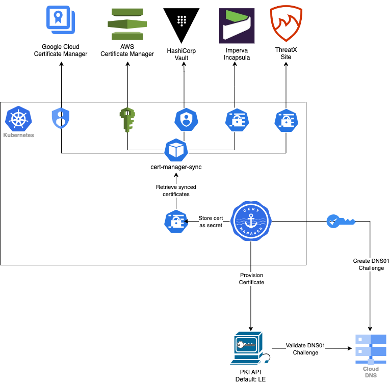

# cert-manager-sync

Enable Kubernetes `cert-manager` to sync TLS certificates to AWS ACM, GCP, HashiCorp Vault, and other remote certificate stores.

- [cert-manager-sync](#cert-manager-sync)
  - [Architecture](#architecture)
  - [Background](#background)
  - [Certificate Stores](#certificate-stores)
    - [AWS ACM](#aws-acm)
    - [Cloudflare](#cloudflare)
    - [DigitalOcean](#digitalocean)
    - [Filepath](#filepath)
    - [Google Cloud](#google-cloud)
    - [HashiCorp Vault](#hashicorp-vault)
    - [Heroku](#heroku)
    - [Hetzner Cloud](#hetzner-cloud)
    - [Incapsula](#incapsula)
    - [ThreatX](#threatx)
  - [Multiple Sync Destinations](#multiple-sync-destinations)
  - [Exponential backoff after a failed sync](#exponential-backoff-after-a-failed-sync)
  - [Forcing an immediate sync](#forcing-an-immediate-sync)
  - [Configuration](#configuration)
  - [Deployment](#deployment)
    - [Optional Operator Configuration](#optional-operator-configuration)
  - [Monitoring](#monitoring)
    - [Prometheus Metrics](#prometheus-metrics)
    - [Error Logging](#error-logging)
  - [PKCS#12 Support for HashiCorp Vault](#pkcs12-support-for-hashicorp-vault)
    - [Configuration](#configuration-1)
    - [Password Management](#password-management)
    - [Storage in Vault](#storage-in-vault)
    - [Example](#example)

## Architecture



## Background

In containerized environments, we use `cert-manager` to automatically provision, manage, and renew TLS certificates for our applications.

These certificates are managed entirely through code using git ops, and developers / operators never need to touch / see the actual plain-text certificate as it is automatically provisioned and attached to gateway.

However for applications that sit behind the Incapsula WAF, or have components in both EKS and CloudFront, there was not a seamless and secure process to attach certificates without operators manually passing DNS01 challenge records back and forth or worse, passing TLS certs back and forth. 

In addition to the security risk this poses, it also introduces a level of human error and manual tracking of expiry / renewals.

This operator fully automates this process, so that developers must only annotate their `cert-manager` kube tls secrets with a flag indicating they want the certificate synced and to where they want it synced.

When the certificate is provisioned by `cert-manager`, the `cert-manager-sync` operator will sync the certificate to the upstream certificate provider(s) defined in the TLS secret annotations.

## Certificate Stores

Certificate stores are configured via Kubernetes annotations on the TLS secret created / managed by `cert-manager`. Before a store can be used, you must enable the sync on the TLS secret by setting the `cert-manager-sync.lestak.sh/sync-enabled` annotation to `true`.

```yaml
    cert-manager-sync.lestak.sh/sync-enabled: "true" # enable sync on tls secret
```

### AWS ACM

Create an IRSA role with `acm:*` access, and attach the IAM Role to the k8s ServiceAccount in `devops/k8s/sa.yaml`. If your workload does not run in EKS, you can create a k8s secret with the AWS credentials and annotate the TLS secret with the secret name with your `AWS_ACCESS_KEY_ID` and `AWS_SECRET_ACCESS_KEY`.

```bash
kubectl -n cert-manager \
	create secret generic example-aws-secret \
	--from-literal AWS_ACCESS_KEY_ID=XXXXX --from-literal AWS_SECRET_ACCESS_KEY=XXXXX
```

Annotations:

```yaml
    cert-manager-sync.lestak.sh/acm-enabled: "true" # sync certificate to ACM
    cert-manager-sync.lestak.sh/acm-role-arn: "" # Role ARN to assume if set
    cert-manager-sync.lestak.sh/acm-region: "" # Region to use. If not set, will use AWS_REGION env var, or us-east-1 if not set
    cert-manager-sync.lestak.sh/acm-certificate-arn: "" # will be auto-filled by operator for in-place renewals
    cert-manager-sync.lestak.sh/acm-secret-name: "" # (optional if not using IRSA) secret in same namespace which contains the aws credentials. If provided in format "namespace/secret-name", will look in that namespace for the secret
```

### Cloudflare

Create a Cloudflare API Key and create a kube secret containing this key.

```bash
kubectl -n cert-manager \
	create secret generic example-cloudflare-secret \
	--from-literal api_key=XXXXX --from-literal email=XXXXX
```

You will then annotate your k8s TLS secret with this secret name to tell the operator to retrieve the Cloudflare API secret from this location.

Annotations:

```yaml
    cert-manager-sync.lestak.sh/cloudflare-enabled: "true" # sync certificate to Cloudflare
    cert-manager-sync.lestak.sh/cloudflare-secret-name: "example-cloudflare-secret" # secret in same namespace which contains the cloudflare api key. If provided in format "namespace/secret-name", will look in that namespace for the secret
    cert-manager-sync.lestak.sh/cloudflare-zone-id: "example-zone-id" # cloudflare zone id
    cert-manager-sync.lestak.sh/cloudflare-cert-id: "" # will be auto-filled by operator for in-place renewals
```

### DigitalOcean

Create a DigitalOcean API Key and create a kube secret containing this key.

```bash
kubectl -n cert-manager \
	create secret generic example-digitalocean-secret \
	--from-literal api_key=XXXXX
```

You will then annotate your k8s TLS secret with this secret name to tell the operator to retrieve the DigitalOcean API secret from this location.

Annotations:

```yaml
    cert-manager-sync.lestak.sh/digitalocean-enabled: "true" # sync certificate to DigitalOcean
    cert-manager-sync.lestak.sh/digitalocean-secret-name: "example-digitalocean-secret" # secret in same namespace which contains the digitalocean api key. If provided in format "namespace/secret-name", will look in that namespace for the secret
    cert-manager-sync.lestak.sh/digitalocean-cert-name: "my-cert" # unique name to give your cert in DigitalOcean
    cert-manager-sync.lestak.sh/digitalocean-cert-id: "" # will be auto-filled by operator for in-place renewals
```

### Filepath

If you want to store the certs in a directory mounted to the operator, you can use the `filepath` sync method. This is useful for storing certs in a shared volume that can be mounted on systems which do not support other sync methods.

Annotations:

```yaml
    cert-manager-sync.lestak.sh/filepath-enabled: "true" # sync certificate to filepath
    cert-manager-sync.lestak.sh/filepath-dir: "/path/to/certs" # directory to store cert
    cert-manager-sync.lestak.sh/filepath-cert: "example.com.crt" # filename to store cert, default is "tls.crt"
    cert-manager-sync.lestak.sh/filepath-ca: "example.com.ca.crt" # filename to store cert, default is "ca.crt"
    cert-manager-sync.lestak.sh/filepath-key: "example.com.key" # filename to store key, default is "tls.key"
```

### Google Cloud

Create a service account with `roles/certificatemanager.editor` rolem and attach the service account to the k8s Service Account in `devops/k8s/sa.yaml`.
```yaml
---
apiVersion: v1
kind: ServiceAccount
metadata:
  name: cert-manager-sync
  namespace: cert-manager
  annotations:
    iam.gke.io/gcp-service-account: GSA_NAME@PROJECT_ID.iam.gserviceaccount.com
```

If your workload does not run in GKE, you can create a k8s secret with the GCP credentials and annotate the TLS secret with the secret name with your `GOOGLE_APPLICATION_CREDENTIALS`.

```bash
kubectl -n cert-manager \
  create secret generic example-gcp-secret \
  --from-file=GOOGLE_APPLICATION_CREDENTIALS=/path/to/credentials.json
```

Annotations:

```yaml
    cert-manager-sync.lestak.sh/gcp-enabled: "true" # sync certificate to GCP
    cert-manager-sync.lestak.sh/gcp-location: LOCATION # GCP location to store cert
    cert-manager-sync.lestak.sh/gcp-project: PROJECT_ID # GCP project to store cert
    cert-manager-sync.lestak.sh/gcp-certificate-name: "" # will be auto-filled by operator for in-place renewals
    cert-manager-sync.lestak.sh/gcp-secret-name: "" # (optional if not using GKE) secret in same namespace which contains the gcp credentials. If provided in format "namespace/secret-name", will look in that namespace for the secret
```

### HashiCorp Vault

HashiCorp Vault relies on the [Kubernetes Auth Method](https://www.vaultproject.io/docs/auth/kubernetes) to securely issue the operator a short-lived token according to your Vault policy. This token is then used to sync the updated certs to Vault so that they can be used by Vault-integrated applications and services.

Annotations:

```yaml
    cert-manager-sync.lestak.sh/vault-addr: "https://vault.example.com" # HashiCorp Vault address
    cert-manager-sync.lestak.sh/vault-namespace: "my-ns/example" # HashiCorp Vault namespace. Only required for Vault EE.
    cert-manager-sync.lestak.sh/vault-role: "role-name" # HashiCorp Vault role name
    cert-manager-sync.lestak.sh/vault-auth-method: "auth-method" # HashiCorp Vault auth method name
    cert-manager-sync.lestak.sh/vault-path: "kv-name/path/to/secret" # HashiCorp Vault path to store cert
    cert-manager-sync.lestak.sh/vault-base64-decode: "true" # base64 decode the cert before storing in Vault. Default is "false"
    cert-manager-sync.lestak.sh/vault-pkcs12: "true" # convert the cert to PKCS#12 format before storing in Vault. Default is "false"
    cert-manager-sync.lestak.sh/vault-pkcs12-password-secret: "secret-name" # name of the secret containing the password (if not specified, a random password will be generated and stored in Vault)
    cert-manager-sync.lestak.sh/vault-pkcs12-password-secret-key: "password" # key in the secret containing the password (defaults to "password")
    cert-manager-sync.lestak.sh/vault-pkcs12-password-secret-namespace: "namespace" # namespace of the secret (defaults to certificate's namespace)
```

### Heroku

Create a Heroku API Key and create a kube secret containing this key.

```bash
kubectl -n cert-manager \
	create secret generic example-heroku-secret \
	--from-literal api_key=XXXXX
```

You will then annotate your k8s TLS secret with this secret name to tell the operator to retrieve the Heroku API secret from this location.

Annotations:

```yaml
    cert-manager-sync.lestak.sh/heroku-enabled: "true" # sync certificate to Heroku
    cert-manager-sync.lestak.sh/heroku-app: "example-app" # heroku app to attach cert
    cert-manager-sync.lestak.sh/heroku-secret-name: "example-heroku-secret" # secret in same namespace which contains the heroku api key. If provided in format "namespace/secret-name", will look in that namespace for the secret
    cert-manager-sync.lestak.sh/heroku-cert-name: "" # will be auto-filled by operator for in-place renewals
```

### Hetzner Cloud

Create a Hetzner Cloud API Token with `Read & Write` permissions for Certificates. The token can be created in the [Hetzner Cloud Console](https://console.hetzner.cloud) under Security → API Tokens.

**Project Scope**: Hetzner Cloud organizes resources into projects, and API tokens are scoped to a specific project. When you use cert-manager-sync with a Hetzner Cloud API token:
- Certificates will be uploaded to the **same project** that issued the API token
- You cannot cross project boundaries with a single token
- Ensure you're using an API token from the correct project where you want the certificates to be available for your Load Balancers

```bash
kubectl -n cert-manager \
	create secret generic example-hetzner-secret \
	--from-literal api_token=XXXXX
```

You will then annotate your k8s TLS secret with this secret name to tell the operator to retrieve the Hetzner Cloud API secret from this location.

Annotations:

```yaml
    cert-manager-sync.lestak.sh/hetznercloud-enabled: "true" # sync certificate to Hetzner Cloud
    cert-manager-sync.lestak.sh/hetznercloud-secret-name: "example-hetzner-secret" # secret in same namespace which contains the hetzner cloud api token. If provided in format "namespace/secret-name", will look in that namespace for the secret
    cert-manager-sync.lestak.sh/hetznercloud-cert-name: "my-cert" # unique name to give your cert in Hetzner Cloud (optional, defaults to secret name)
    cert-manager-sync.lestak.sh/hetznercloud-cert-id: "" # will be auto-filled by operator for in-place renewals
    cert-manager-sync.lestak.sh/hetznercloud-label-environment: "production" # (optional) add labels to the certificate in Hetzner Cloud
    cert-manager-sync.lestak.sh/hetznercloud-label-team: "devops" # (optional) add more labels as needed
```

**Notes:**
- Certificates can be attached to Hetzner Cloud Load Balancers for TLS termination
- The operator will automatically handle certificate renewals by creating new certificates and removing old ones
- If a certificate is in use by a Load Balancer, the operator will create a new certificate with a modified name instead of deleting the in-use certificate

Hetzner Cloud store supports optional integration testing with a real API. To run:

```bash
export HETZNER_TEST_TOKEN="your-hetzner-api-token"
go test ./stores/hetznercloud/... -v
```

**Note**: Use a test project token to avoid affecting production resources. The test will create and clean up test certificates in the project associated with the API token.

### Incapsula

Create an Incapsula API Key and create a kube secret containing this key.

```bash
kubectl -n cert-manager \
	create secret generic example-incapsula-api-secret \
	--from-literal api_id=XXXXX --from-literal api_key=XXXXX
```

You will then annotate your k8s TLS secret with this secret name to tell the operator to retrieve the Incapsula API secret from this location.

Annotations:

```yaml
    cert-manager-sync.lestak.sh/incapsula-site-id: "12345" # incapsula site to attach cert
    cert-manager-sync.lestak.sh/incapsula-secret-name: "cert-manager-sync-poc" # secret in same namespace which contains the incapsula api key. If provided in format "namespace/secret-name", will look in that namespace for the secret
```

### ThreatX

Create a ThreatX API Key and create a kube secret in the namespace in which the operator runs.

```bash
kubectl -n cert-manager \
	create secret generic example-threatx-api-secret \
	--from-literal api_token=XXXXX --from-literal customer_name=XXXXX
```

You will then annotate your k8s TLS secret with this secret name to tell the operator to retrieve the ThreatX API secret from this location.

Annotations:

```yaml
    cert-manager-sync.lestak.sh/threatx-hostname: "example.com" # threatx hostname to attach cert
    cert-manager-sync.lestak.sh/threatx-secret-name: "example-threatx-api-secret" # secret in same namespace which contains the threatx api key. If provided in format "namespace/secret-name", will look in that namespace for the secret
```

## Multiple Sync Destinations

You are able to sync to multiple destinations from a single source secret by suffixing your config keys with a common index.

```yaml
    cert-manager-sync.lestak.sh/incapsula-site-id: "12345" # the default, as seen above
    cert-manager-sync.lestak.sh/incapsula-secret-name: "cert-manager-sync-poc" # the default, as seen above
    cert-manager-sync.lestak.sh/incapsula-site-id.0: "67890" # the default, as seen above
    cert-manager-sync.lestak.sh/incapsula-secret-name.0: "another-secret-here" # the default, as seen above
    cert-manager-sync.lestak.sh/incapsula-site-id.1: "98765" # the default, as seen above
    cert-manager-sync.lestak.sh/incapsula-secret-name.1: "and-another-secret-here" # the default, as seen above
```

Note that if you are using multiple destinations, each key must be defined for each index. For example, if you are syncing to 3 Incapsula sites, but are using the same secret, you still need to define the secret name for each index.

```yaml
    cert-manager-sync.lestak.sh/incapsula-site-id: "12345" # the default, as seen above
    cert-manager-sync.lestak.sh/incapsula-secret-name: "cert-manager-sync-poc" # the default, as seen above
    cert-manager-sync.lestak.sh/incapsula-site-id.0: "67890" # the default, as seen above
    cert-manager-sync.lestak.sh/incapsula-site-id.1: "98765" # the default, as seen above
    cert-manager-sync.lestak.sh/incapsula-site-id.2: "54321" # the default, as seen above
    cert-manager-sync.lestak.sh/incapsula-secret-name.0: "cert-manager-sync-poc" # the default, as seen above
    cert-manager-sync.lestak.sh/incapsula-secret-name.1: "cert-manager-sync-poc" # the default, as seen above
    cert-manager-sync.lestak.sh/incapsula-secret-name.2: "cert-manager-sync-poc" # the default, as seen above
```

## Exponential backoff after a failed sync

Previously, a failed sync will be retried every `60s` which — especially in larger installations — could cause rate limits to be hit as well as overwhelm external services. Failed attempts are now retried with a binary exponential backoff starting with `60s` then `120s`, `240s` up to a maximum of `32h`. As part of the new backoff behavior, new `cert-manager-sync.lestak.sh/failed-sync-attempts`, `cert-manager-sync.lestak.sh/next-retry`, and `cert-manager-sync.lestak.sh/max-sync-attempts` fields were added to the `cert-manager-sync` Secret annotations to track the number of currently failed syncs and when the next retry will be attempted.

By default, the operator will continue to retry indefinitely until the sync is successful, or the sync annotation is removed. If you would like to limit the number of retries, you can set the `cert-manager-sync.lestak.sh/max-sync-attempts` annotation to the number of retries you would like to allow.

```yaml
    cert-manager-sync.lestak.sh/max-sync-attempts: "5" # limit the number of retries to 5, after which you will need to manually resolve the underlying issue and reset/remove the failed-sync-attempts annotation
```

If your sync gets put into a backoff and you've made the required changes and want to immediately retry, you can remove the `cert-manager-sync.lestak.sh/next-retry` annotation. This will cause the operator to immediately retry the sync.

```yaml
    cert-manager-sync.lestak.sh/next-retry: "2022-01-01T00:00:00Z" # next retry time (RFC3339), will be auto-filled by operator. Remove this if you want to retry immediately.
```

```bash
kubectl -n cert-manager \
	annotate secret secret-name \
	cert-manager-sync.lestak.sh/next-retry- \
	--overwrite
```

## Forcing an immediate sync

By default, the operator will only sync certs to the remote store(s) if the certificate or `cert-manager-sync` annotations have changed. This is to prevent unnecessary syncs and rate limiting on the remote stores. If however, you've deleted the remote certificate or otherwise need to force an immediate sync, you can update the `cert-manager-sync.lestak.sh/hash` annotation on the secret to a new value. This will cause the operator to immediately sync the certificate to the remote store(s).

```bash
kubectl -n cert-manager \
  annotate secret secret-name \
  cert-manager-sync.lestak.sh/hash- \
  --overwrite
```

## Configuration

The operator uses Kubernetes annotations to define the sync locations and configurations.

The following example secret contains all supported annotations.

```yaml
---
apiVersion: v1
type: kubernetes.io/tls
kind: Secret
metadata:
  name: example
  namespace: cert-manager
  annotations:
    cert-manager-sync.lestak.sh/sync-enabled: "true" # enable sync on tls secret
    cert-manager-sync.lestak.sh/acm-enabled: "true" # sync certificate to ACM
    cert-manager-sync.lestak.sh/acm-role-arn: "" # Role ARN to assume if set
    cert-manager-sync.lestak.sh/acm-region: "" # Region to use. If not set, will use AWS_REGION env var, or us-east-1 if not set
    cert-manager-sync.lestak.sh/acm-certificate-arn: "" # will be auto-filled by operator for in-place renewals
    cert-manager-sync.lestak.sh/acm-secret-name: "" # (optional if not using IRSA) secret in same namespace which contains the aws credentials. If provided in format "namespace/secret-name", will look in that namespace for the secret
    cert-manager-sync.lestak.sh/cloudflare-enabled: "true" # sync certificate to Cloudflare
    cert-manager-sync.lestak.sh/cloudflare-secret-name: "example-cloudflare-secret" # secret in same namespace which contains the cloudflare api key. If provided in format "namespace/secret-name", will look in that namespace for the secret
    cert-manager-sync.lestak.sh/cloudflare-zone-id: "example-zone-id" # cloudflare zone id
    cert-manager-sync.lestak.sh/cloudflare-cert-id: "" # will be auto-filled by operator for in-place renewals
    cert-manager-sync.lestak.sh/digitalocean-enabled: "true" # sync certificate to DigitalOcean
    cert-manager-sync.lestak.sh/digitalocean-secret-name: "example-digitalocean-secret" # secret in same namespace which contains the digitalocean api key. If provided in format "namespace/secret-name", will look in that namespace for the secret
    cert-manager-sync.lestak.sh/digitalocean-cert-name: "my-cert" # unique name to give your cert in DigitalOcean
    cert-manager-sync.lestak.sh/digitalocean-cert-id: "" # will be auto-filled by operator for in-place renewals
    cert-manager-sync.lestak.sh/filepath-enabled: "true" # sync certificate to filepath
    cert-manager-sync.lestak.sh/filepath-dir: "/path/to/certs" # directory to store cert
    cert-manager-sync.lestak.sh/filepath-cert: "example.com.crt" # filename to store cert, default is "tls.crt"
    cert-manager-sync.lestak.sh/filepath-ca: "example.com.ca.crt" # filename to store ca cert, default is "ca.crt" (if provided)
    cert-manager-sync.lestak.sh/filepath-key: "example.com.key" # filename to store key, default is "tls.key"
    cert-manager-sync.lestak.sh/gcp-enabled: "true" # sync certificate to GCP
    cert-manager-sync.lestak.sh/gcp-location: LOCATION # GCP location to store cert
    cert-manager-sync.lestak.sh/gcp-project: PROJECT_ID # GCP project to store cert
    cert-manager-sync.lestak.sh/gcp-certificate-name: "" # will be auto-filled by operator for in-place renewals
    cert-manager-sync.lestak.sh/gcp-secret-name: "" # (optional if not using GKE) secret in same namespace which contains the gcp credentials. If provided in format "namespace/secret-name", will look in that namespace for the secret
    cert-manager-sync.lestak.sh/heroku-enabled: "true" # sync certificate to Heroku
    cert-manager-sync.lestak.sh/heroku-app: "example-app" # heroku app to attach cert
    cert-manager-sync.lestak.sh/heroku-secret-name: "example-heroku-secret" # secret in same namespace which contains heroku api key
    cert-manager-sync.lestak.sh/heroku-cert-name: "" # will be auto-filled by operator for in-place renewals
    cert-manager-sync.lestak.sh/hetznercloud-enabled: "true" # sync certificate to Hetzner Cloud
    cert-manager-sync.lestak.sh/hetznercloud-secret-name: "example-hetzner-secret" # secret in same namespace which contains hetzner cloud api token
    cert-manager-sync.lestak.sh/hetznercloud-cert-name: "my-cert" # unique name to give your cert in Hetzner Cloud
    cert-manager-sync.lestak.sh/hetznercloud-cert-id: "" # will be auto-filled by operator for in-place renewals
    cert-manager-sync.lestak.sh/incapsula-site-id: "12345" # incapsula site to attach cert
    cert-manager-sync.lestak.sh/incapsula-secret-name: "cert-manager-sync-poc" # secret in same namespace which contains incapsula api key
    cert-manager-sync.lestak.sh/threatx-hostname: "example.com" # threatx hostname to attach cert
    cert-manager-sync.lestak.sh/threatx-secret-name: "example-threatx-api-secret" # secret in same namespace which contains threatx api key
    cert-manager-sync.lestak.sh/vault-addr: "https://vault.example.com" # HashiCorp Vault address
    cert-manager-sync.lestak.sh/vault-namespace: "my-ns/example" # HashiCorp Vault namespace. Only required for Vault EE.
    cert-manager-sync.lestak.sh/vault-role: "role-name" # HashiCorp Vault role name
    cert-manager-sync.lestak.sh/vault-auth-method: "auth-method" # HashiCorp Vault auth method name
    cert-manager-sync.lestak.sh/vault-path: "kv-name/path/to/secret" # HashiCorp Vault path to store cert
    cert-manager-sync.lestak.sh/vault-base64-decode: "true" # base64 decode the cert before storing in Vault. Default is "false"
    cert-manager-sync.lestak.sh/vault-pkcs12: "true" # convert the cert to PKCS#12 format before storing in Vault. Default is "false"
    cert-manager-sync.lestak.sh/vault-pkcs12-password-secret: "secret-name" # name of the secret containing the password (if not specified, a random password will be generated and stored in Vault)
    cert-manager-sync.lestak.sh/vault-pkcs12-password-secret-key: "password" # key in the secret containing the password (defaults to "password")
    cert-manager-sync.lestak.sh/vault-pkcs12-password-secret-namespace: "namespace" # namespace of the secret (defaults to certificate's namespace)
    cert-manager-sync.lestak.sh/max-sync-attempts: "5" # limit the number of retries to 5, after which you will need to manually resolve the underlying issue and reset/remove the failed-sync-attempts annotation
    cert-manager-sync.lestak.sh/failed-sync-attempts: "0" # number of failed sync attempts, will be auto-filled by operator
    cert-manager-sync.lestak.sh/next-retry: "2022-01-01T00:00:00Z" # next retry time (RFC3339), will be auto-filled by operator. Remove this if you want to retry immediately.
    cert-manager-sync.lestak.sh/hash: "abc123" # hash of the secret for tracking changes, will be auto-filled by operator
data:
  tls.crt: ""
  tls.key: ""
```

`cert-manager-sync` only looks at kubernetes secrets, however you can create a `cert-manager` `Certificate` resource with the annotations inline if you would like:

```yaml
---
apiVersion: cert-manager.io/v1
kind: Certificate
metadata:
 name: example.com
 namespace: cert-manager
spec:
 secretName: example.com
 secretTemplate:
  annotations:
    cert-manager-sync.lestak.sh/sync-enabled: "true" # enable sync on tls secret
    cert-manager-sync.lestak.sh/incapsula-site-id: "12345" # incapsula site to attach cert
    cert-manager-sync.lestak.sh/incapsula-secret-name: "cert-manager-sync-poc" # secret in same namespace which contains incapsula api key. if provided in format "namespace/secret-name", will look in that namespace for the secret
 issuerRef:
   name: my-issuer
   kind: Issuer
 dnsNames:
   - 'example.com'
```

## Deployment

Deploy the operator:

```bash
helm upgrade --install -n cert-manager cert-manager-sync ./deploy/cert-manager-sync
```

### Optional Operator Configuration

The operator can be deployed as-is with no additional configuration. However, you can configure the following environment variables to customize the operator:

```bash
DISABLED_NAMESPACES= # csv of namespaces to ignore. default is empty (all namespaces are watched)
ENABLED_NAMESPACES= # csv of namespaces to watch. default is empty (all namespaces are watched)
SECRETS_NAMESPACE= # DEPRECATED, replaced by ENABLED_NAMESPACES. Namespace to look for secrets in. overrides ENABLED_NAMESPACES if set
OPERATOR_NAME=cert-manager-sync.lestak.sh # Operator name. use for white-labeling
LOG_LEVEL=info # Log level. trace, debug, info, warn, error, fatal
CACHE_DISABLE=false # Disable cache
METRICS_PORT=9090 # Metrics port
ENABLE_METRICS=true # Enable metrics server
```

If deploying with helm, these are exposed as values in the `values.yaml` file.

```yaml
config:
  operatorName: cert-manager-sync.lestak.sh
  secretsNamespace: ""
  disabledNamespaces: ""
  enabledNamespaces: ""
  logLevel: "info"
  logFormat: "json"
  disableCache: "false"

metrics:
  enabled: false
  port: 9090
```

## Monitoring

### Prometheus Metrics

The operator exposes Prometheus metrics on `/metrics` endpoint. You can use the following query to monitor the sync status:

```promql
cert_manager_sync_status{namespace="cert-manager",secret="example",store="acm",status="success"}
```

Setting `ENABLE_METRICS=false` will disable the metrics server.

### Error Logging

The following log filter will display just errors syncing certificates:

```bash
level=error action=SyncSecretToStore
```

The following fields are included in the sync error log message:

```bash
level=error action=SyncSecretToStore namespace=cert-manager secret=example store=acm error="error message"
```

## PKCS#12 Support for HashiCorp Vault

The Vault provider supports converting certificates to PKCS#12 format before storing them in Vault. This is useful for applications that require certificates in PKCS#12 format.

### Configuration

To enable PKCS#12 conversion, add the following annotation to your TLS secret:

```yaml
cert-manager-sync.lestak.sh/vault-pkcs12: "true"
```

### Password Management

The PKCS#12 format requires a password. You can provide a password in two ways:

1. **Using a Kubernetes Secret (Recommended)**:
   ```yaml
   cert-manager-sync.lestak.sh/vault-pkcs12-password-secret: "my-secret"
   cert-manager-sync.lestak.sh/vault-pkcs12-password-secret-key: "password" # Optional, defaults to "password"
   cert-manager-sync.lestak.sh/vault-pkcs12-password-secret-namespace: "my-namespace" # Optional, defaults to certificate's namespace
   ```

2. **Automatic Password Generation**:
   If no password secret is specified, a random password will be generated and stored in Vault alongside the PKCS#12 file in the `pkcs12-password` field.

### Storage in Vault

When PKCS#12 conversion is enabled, the following data will be stored in Vault:

- `tls.crt`: The original certificate in PEM format
- `tls.key`: The original private key in PEM format
- `ca.crt`: The CA certificate in PEM format (if provided)
- `pkcs12`: The certificate in PKCS#12 format
- `pkcs12-password`: The password for the PKCS#12 file (only if a random password was generated)

### Example

```yaml
apiVersion: v1
kind: Secret
metadata:
  name: example-tls
  namespace: default
  annotations:
    cert-manager-sync.lestak.sh/sync-enabled: "true"
    cert-manager-sync.lestak.sh/vault-enabled: "true"
    cert-manager-sync.lestak.sh/vault-addr: "https://vault.example.com"
    cert-manager-sync.lestak.sh/vault-path: "secret/data/certs/example"
    cert-manager-sync.lestak.sh/vault-pkcs12: "true"
    cert-manager-sync.lestak.sh/vault-pkcs12-password-secret: "my-password-secret"
type: kubernetes.io/tls
data:
  tls.crt: ...
  tls.key: ...
```
